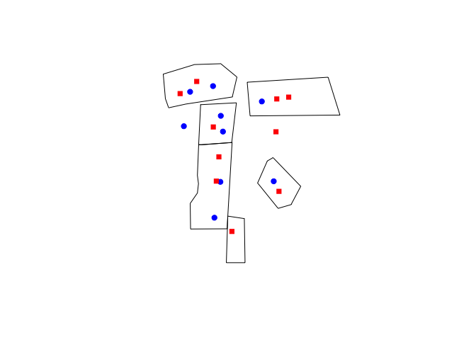

<!-- README.md is generated from README.Rmd. Please edit that file -->
Overview
--------

sppt is an [R](https://www.r-project.org) package that implements Martin Andresen's Spatial Point Pattern Test. It has been published [here](http://jrc.sagepub.com/content/48/1/58) (and elsewhere). The test measures the degree of similarity at the local level between two spatial point patterns and is an area-based test.

This spatial point pattern test is not for the purpose of testing point patterns with the null hypotheses of random, uniform, or clustered distributions, but may be used to compare a particular point pattern with these distributions. One advantage of the test is that it can be performed for a number of different area boundaries using the same original point datasets.

In February 2018 a new test was added to the package courtesy of Andrew Wheeler, as a result of the following publication:

> Wheeler, A., Steenbeek, W., & Andresen, M.A. (2018). Testing for Similarity in Area-Based Spatial Patterns: Alternative Methods to Andresen's Spatial Point Pattern Test. (SSRN: <https://papers.ssrn.com/sol3/papers.cfm?abstract_id=3111822>)

Therefore the most recent version of the package has changed from version 0.1.4 to version 0.1.5. For version 0.1.4, please cite package 'sppt' in publications as:

> Steenbeek, W., Vandeviver, C. Andresen, M.A., Malleson, N. (2017). *sppt: Spatial Point Pattern Test*. R package version 0.1.4. URL: <https://github.com/wsteenbeek/sppt>

For version 0.1.5, the updated reference is:

> Steenbeek, W., Vandeviver, C. Andresen, M.A., Malleson, N., Wheeler, A. (2018). *sppt: Spatial Point Pattern Test*. R package version 0.1.5. URL: <https://github.com/wsteenbeek/sppt>

Installation
------------

You can install the package from this [GitHub repository](https://github.com/wsteenbeek/sppt). You first need to install the [devtools](https://CRAN.R-project.org/package=devtools) package.

``` r
install.packages("devtools")
```

Then install sppt using the `install_github` function in the [devtools](https://CRAN.R-project.org/package=devtools) package.

``` r
devtools::install_github("wsteenbeek/sppt")
```

Example
-------

Spatial objects areas.sp, points1.sp, and points2.sp, are included in the package. For example, you can think of these as neighborhoods and the locations where crimes occur in two different years.

``` r
library(sppt)
#> Loading required package: sp
#> Warning: package 'sp' was built under R version 3.4.3
plot(areas.sp)
points(points1.sp, col="blue", pch = 19)
points(points2.sp, col="red", pch = 15)
```



The original function within the sppt package is also called `sppt`:

``` r
set.seed(93255) # set seed for reproducibility
output <- sppt(points1.sp, points2.sp, areas.sp)
```

Two other functions were added in February 2018. `sppt_boot()`:

``` r
set.seed(93255) # set seed for reproducibility
output2 <- sppt_boot(points1.sp, points2.sp, areas.sp)
```

and `sppt_diff()`:

``` r
set.seed(93255) # set seed for reproducibility
output3 <- sppt_diff(points1.sp, points2.sp, areas.sp)
```

You can see the results of the test by inspecting the SpatialPolygonsDataFrame, for example:

``` r
output@data
#>   ID uoa_id SIndex NumBsePts NumTstPts PctBsePts PctTstPts SumBseTstPts
#> 0  1      1      0         2         2      25.0  22.22222            4
#> 1  4      2      1         2         1      25.0  11.11111            3
#> 2  5      3      0         2         2      25.0  22.22222            4
#> 3  6      4      0         1         2      12.5  22.22222            3
#> 4 11      5      0         0         1       0.0  11.11111            1
#> 5 15      6      0         1         1      12.5  11.11111            2
#>   ConfLowP ConfUppP localS similarity   globalS SIndex.robust
#> 0     12.5     25.0      0          1 0.8333333             0
#> 1      0.0     12.5     -1          0 0.8333333             1
#> 2     12.5     25.0      0          1 0.8333333             0
#> 3     12.5     25.0      0          1 0.8333333             0
#> 4      0.0     12.5      0          1 0.8333333             0
#> 5      0.0     12.5      0          1 0.8333333             0
#>   localS.robust similarity.robust globalS.robust
#> 0             0                 1      0.8333333
#> 1            -1                 0      0.8333333
#> 2             0                 1      0.8333333
#> 3             0                 1      0.8333333
#> 4             0                 1      0.8333333
#> 5             0                 1      0.8333333
```

The package includes vignettes explaining the sppt procedure in more detail; a worked example of a toy dataset and actual crime data; a comparison between this R package and an existing Java application that has been written by [Nick Malleson](http://nickmalleson.co.uk/); and the new functions `sppt_boot()` and `sppt_diff()`.

You can view which vignettes are available using:

``` r
vignette(package = "sppt")
```

You can read the vignettes using:

``` r
vignette("sppt", package = "sppt")
vignette("sppt_comparison", package = "sppt")
vignette("sppt_diff", package = "sppt")
```

License
-------

This package is free software; you can redistribute it and/or modify it under the terms of the GNU General Public License, version 3, as published by the Free Software Foundation.

This program is distributed in the hope that it will be useful, but without any warranty; without even the implied warranty of merchantability or fitness for a particular purpose. See the GNU General Public License for more details.

A copy of the GNU General Public License, version 3, is available at <https://www.r-project.org/Licenses/GPL-3>
